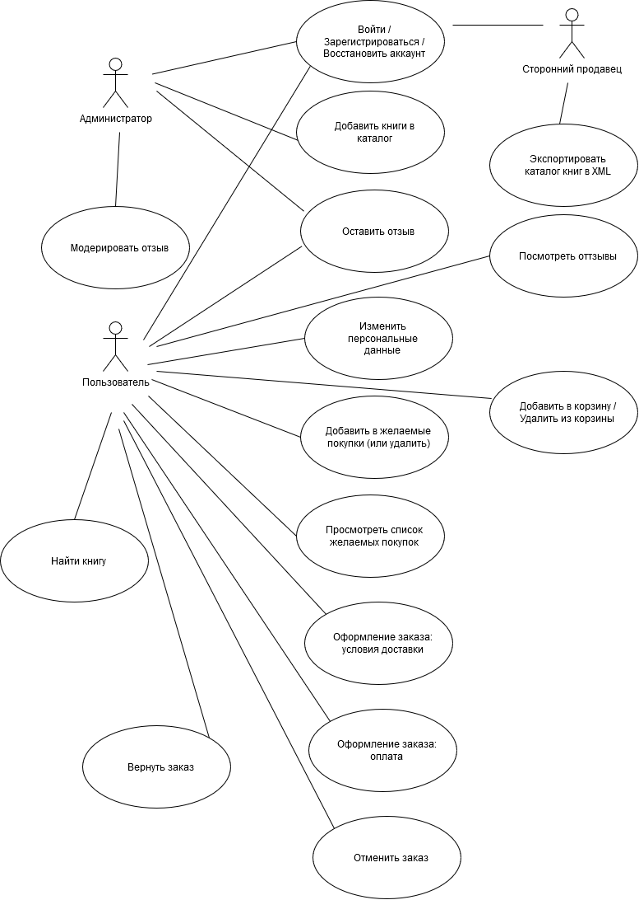
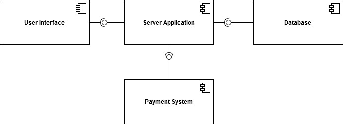
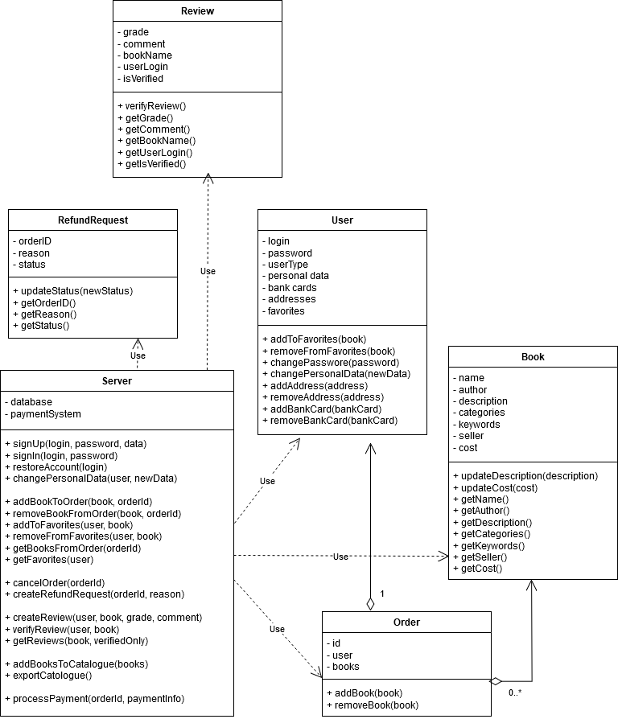

# Магазин книг

## Общие сведения о системе

Поддерживаются такие функции, как покупка и продажа, возможность оставлять отзывы и система рейтинга, различные механизмы поиска, удобная встраиваемость в другие сервисы. 

## Architectural Drivers

* **Функциональные требования**. 
    - Интернет-магазин должен иметь веб-интерфейс, но он должен иметь возможность подключения через другие интерфейсы (например, веб-сервисы)
    - Возможность продажи книг с оплатой через интернет.
    - Сохранение информации о пользователях между сессиями. 
    - Поддержка корзины пользователя и списка его желаемых покупок. 
    - Полноценный инструментарий для работы с заказами: оплата банковской картой или с помощью счёта, возможность отменить заказ до его отправления или вернуть заказ. 
    - Система отзывов: пользователи и администраторы должны иметь возможность оставить отзыв. Поддержка просмотра отзывов. Поддержка модерации отзывов. 
    - Пользователь должен иметь возможность искать книги различными способами поиска – по заголовку, по автору, ключевому слову или категории и после поиска просматривать детальное описание книги.
    - Возможность встраивать каталог книг на сайты партнёров. Обеспечение экспорта в формате XML.
    - Поддержка механизма добавления книг для сторонних продавцов. 
* **Масштабируемость**. Интернет-магазин должен быть масштабируем со следующими требованиями:
    - Должна быть возможность управлять до 100 тыс. учетных записей пользователей за первые 6 месяцев работы и затем до 1 млн. пользователей.
    - Должна быть возможность обслуживать одновременно 1000 посетителей (до 10000 после 6 месяцев)
    - Система должна обслуживать 100 поисковых запросов в минуту (1 тыс./мин. после 6 месяцев)
    - Система должна обслуживать 100 покупок в час (1 тыс./час после 6 мес.)

## Роли и случаи использования

## Композиция

* **Веб-приложение**. Обеспечивает взаимодействие пользователей с серверным приложением в удобном формате. 
* **Серверное приложение**. Отвечает за бизнес-логику системы. Отвечает на запросы пользователей, взаимодействует с базой данных и системой платежей. Масштабируется с помощью балансировщика нагрузки (то есть может быть поднято несколько инстансов серверного приложения). 
* **База данных**. Хранит информацию о пользователях, книгах, заказах и отзывах на книги. В целях масштабируемости является распределённой. 
* **Система оплаты**. Обрабатывает платежи пользователей. Позволяет пользователям оплачивать заказы с помощью кредитной карты и посредством счетов на оплату. 

## Логическая структура

Все запросы обрабатывает класс **Server**, который хранит внутри себя инстансы базы данных и системы обработки платежей. Для удобного функционирования системы выделены такие сущности, как пользователь **User** (хранит в себе логин и пароль, личные данные, адреса для доставок, банковские карты и список отложенных книг), книга **Book** (содержит название книги, её автора, описание, список жанров, к которым она относится, ключевые слова для поиска, продавца и цену), заказ **Order** (хранит пользователя и список книг, добавленных им в корзину на текущий момент), отзыв **Review** (состоит из оценки, комментария, оцениваемой книги, автора отзыва и информации о том, проверен ли данный отзыв) и заявление о возврате **RefundRequest** (номер заказа, причина и статус заявления). 

